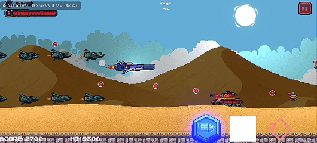
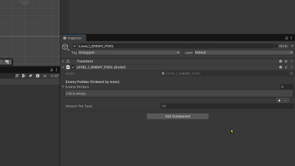
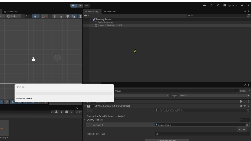
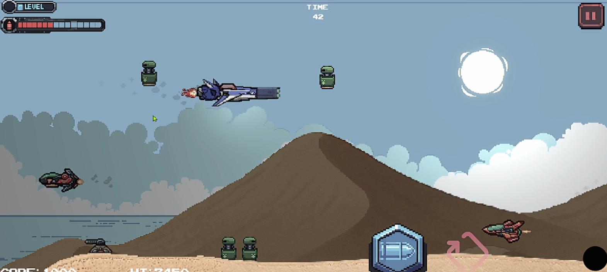
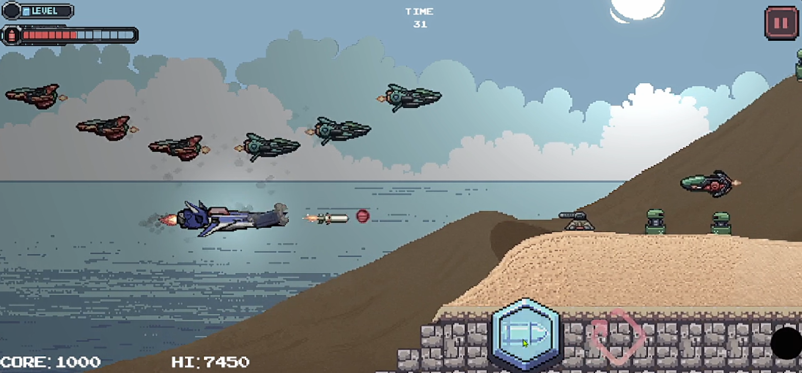

# SPACE WAR — 2D Side-Scrolling Shooter (Unity / C#)
2D spaceship shoot em up(SHMUP) game project with a new core mechanic, reverse shooting, that opens up a whole new design of level and gameplay. 

**Demo (Video):** https://youtu.be/tWPMJfAvKvk
**Tools** Unity (VERSION), C#, 2D Physics, Object Pooling, Event-driven systems

## Overview
A 2D side-scrolling spaceship shooter focused on a new reverse shooting core mechanic that has never been done before.

## Key Features
- Player movement, shooting, and collision handling
- Enemy behaviors (turrets / flyers / pattern movement)
- Power gauge + weapon upgrades
- UI feedback (health, score, gauge, hit effects)
- Performance-focused runtime via object pooling

## Systems I have Built
### Object Pooling
- Reuses player's bullets game object/enemies object/ to reduce instantiation and improve performance  
- Example code: `code-snippets/ObjectPool.cs`

- Putting the game object you want to pool so we can store them in enemyPools, and keep them inactive with SetActive(false). 

- When you need to spawn an enemy, you grab an inactive one, set its position/state, call SetActive(true), and when it’s “done” (killed/off-screen) you disable it again so it can be reused—avoiding repeated Instantiate/Destroy performance spikes.

### Scrolling Background
- Built a side-scrolling system that continuously moves background/terrain to simulate going forward motion.
- Recycled background segments to create an infinite scrolling loop without creating new objects at runtime.
- Supported consistent scroll speed and seamless transitions between segments.
- Example code:
`code-snippets/BgProperties.cs`

## Screenshots
 

## Running
This repo is a portfolio showcase (not the full Unity project).  
If you'd like access to the full project/code, contact me at sothearnithsreng@gmail.com